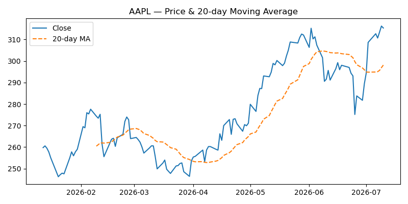
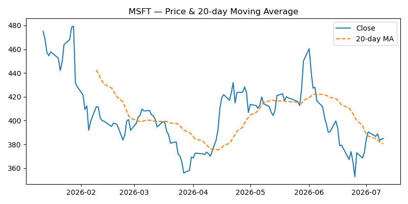
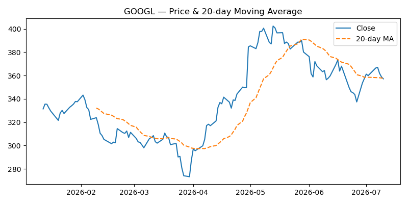
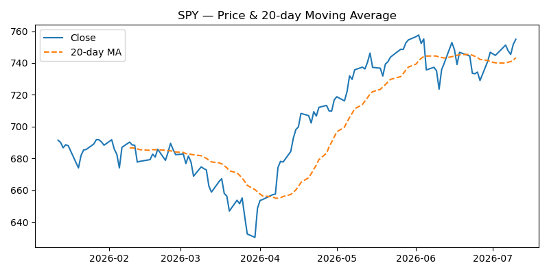

# MarketPulse AI

A daily-built project that turns raw market data into plain-English insights using data pipelines, ML, and an LLM layer. Built incrementally, one day at a time, as a public portfolio piece for an AI/data career switch.

## Why this project

- Combines **data engineering** (daily ingestion), **ML** (predictive signals), and **GenAI** (LLM-generated summaries) — the three things worth showing an employer.
- Domain: finance/markets — a small watchlist of stocks/ETFs, updated daily.
- Format: one growing repo, daily commits, visible progress over time.

## Roadmap (grows as we go)

| Day | Milestone |
|---|---|
| 1 | Data ingestion: pull daily OHLCV data for a watchlist, save to CSV |
| 2 | Exploratory analysis + basic visualizations (price, returns, volatility) |
| 3 | Feature engineering (moving averages, RSI, volatility bands) |
| 4 | Baseline ML model: predict next-day direction (up/down) |
| 5 | Model evaluation + simple backtest |
| 6 | LLM layer: turn model output + data into a plain-English daily summary |
| 7 | Automate: script runs end-to-end, writes a daily "report" file |
| 8+ | Add news sentiment (RAG over headlines), improve model, build a simple dashboard |

Each day's work lives in `src/dayNN_*.py`. Progress is logged in `progress_log.md`.

## Sample Output

Price + 20-day moving average, generated by `src/day02_eda.py`:

<table>
<tr>
<td></td>
<td></td>
</tr>
<tr>
<td></td>
<td></td>
</tr>
</table>

Returns distribution and rolling volatility charts are also generated per ticker — see `outputs/charts/`.

## Setup

```bash
pip install -r requirements.txt
python src/day01_data_ingestion.py
```

## Status

Day 3 complete — see `progress_log.md`.
